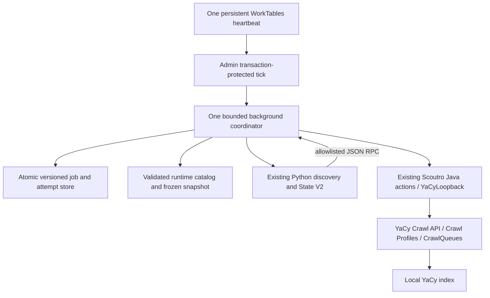

# Scoutro Discovery Automation V1 — implementation report

Date: 2026-10-02. Branch: `feat/scoutro-discovery-automation-v1`.
Base: current remote main at work start, `1a9a728063915a36c5fd0baf8fbeb6ae6d0f8c8d`.
The implementation commit is the branch head (`git log -1`). This report belongs to that commit.

**Scope:** implementation and isolated validation only. No merge, image publication, release, Olares change, deployment, productive crawl/scheduler activation, taxonomy/config/state change or automated Classification. Global automation defaults to disabled. Full operational reference: [Discovery help](../help/ScoutroDiscovery_p.md).

## 1–3. Branch, commit and file inventory

The new feature branch contains the code, focused tests, all corresponding help/localization/API artifacts and this report. No example/runtime taxonomy file was changed. Full file inventory is listed at the end; the final response provides the exact pushed commit.

## 4. Architecture



WorkTables is only the persistent clock. Java owns jobs, job cursors, run reservations and dispatch intents. Python owns domain/profile state and candidate eligibility. YaCy owns crawl execution, robots, queues and indexing. Classification remains a separate, uncalled component. No new crawling worker or parallel candidate-state engine is introduced.

## 5. Final job schema

Example with a **synthetic profile**, not a portal built into code:

```json
{
  "id": "3276af9c-b8b5-4b8c-bc2b-17b8d1905eb7",
  "name": "Example regional job",
  "enabled": false,
  "paused": false,
  "profile": "new_profile",
  "candidate_scope": "source_regions",
  "sources": {
    "osm": {"mode": "selected", "regions": ["configured-extract-id"]},
    "freeworld": {"mode": "selected", "regions": ["Configured search text"]}
  },
  "discovery": {"replenish": true, "replenish_interval_hours": 24},
  "batch": {"max_domains": 50, "max_pages": 15, "depth": 2, "seed_delay_seconds": 10},
  "processing": {"fresh": true, "retry": false, "recrawl": {"enabled": false, "days": 30}},
  "schedule": {"every_minutes": 60}
}
```

The server assigns UUID. Region values must exist in their own source catalog. `mode=all` uses `regions=[]` and the current source catalog. `profile_backlog` includes unknown legacy provenance; with replenishment disabled it may have an empty source map. Collection comes exclusively from the canonical profile. No force, arbitrary command/path, credentials or Classification parameter. Unknown fields, incompatible types and limits are rejected. PATCH merges nested settings; its sources map replaces the whole sources map.

Server-configured limits default to 100 domains/100 pages/depth 5, absolute ceilings 500/10000/10. Delay is 0–300 seconds; schedules at least 10 minutes; recrawl 1–3650 days; discovery refresh 1–8760 hours. The bridge still enforces existing Scoutro Crawl API limits.

## 6–9. Runtime resolution, profile and region catalogs

| Concern | Resolution / source of truth |
| --- | --- |
| Config root | `SCOUTRO_CONFIG_ROOT` → `scoutro.discovery.configRoot` → `DATA/SCOUTRO/config` |
| Existing candidate state root | `SCOUTRO_DISCOVERY_DIR` → `scoutro.discovery.stateRoot` → `DATA/SCOUTRO/discovery` |
| Profile identity/collection | `profiles.json.profiles`, explicit validated collection; no `<profile>-web` fallback |
| Freeworld capability | Usable terms in `profiles.conf` |
| OSM capability | Usable rules in `osm_profiles.json`, with a nonempty extract predicate |
| OSM region IDs | `osm_regions.txt`, existing Germany/Geofabrik provider |
| Freeworld search texts | `regions.txt`, independent from OSM extract IDs |

No automation fallback to repository examples or OpenCode-specific path. CLI `--config-dir` takes precedence over the environment; the legacy manual CLI retains its existing examples default. Canonical metadata and source rules remain external runtime configuration, not job definitions or source taxonomy.

The five runtime files are size bounded and double-read; SHA-256 includes filename/presence/bytes. Catalog capabilities show unsupported sources without hiding a valid profile. Removed profile/region references block jobs visibly. Each batch freezes its validated snapshot under `DATA/SCOUTRO/automation/config-snapshots/<fingerprint>` with private atomic writes; an existing snapshot is checked before reuse. OSM labels are generated from IDs, without a hardcoded state list or artificial geo mapping. Adding a profile/region only changes runtime configuration. Adding a provider later extends the registry/catalog/adapter, not the job schema.

## 10–11. Backlog and provenance

The existing Python State V2 stores **every accepted, deduplicated discovered pair**, before dispatch limits apply:
`domains.<domain>.profiles.<profile>` contains collection, candidate URL, discovery timestamps, source/source_region and an origins list. Missing final status remains fresh. Existing statuses, Classification, other profile entries and custom fields survive. Origins merge when the same pair is found through multiple sources/regions. The older `region` location label is preserved independently.

Selection reuses `selection_kind`, `select_domains`, shared DNS/robots precheck, backoff and cooldown. Processing masks distinguish fresh, retry/problematic-after-cooldown and recrawl. No automatic force. Mutating Python paths acquire `run.lock` **before** reading the state. Existing atomic state writes/state lock remain.

Existing unknown origins are not guessed. A profile-wide backlog job can drain them. Known previously discovered fresh totals were not fully saved by the old manual path; an initial rediscovery is required to populate durable backlog. Already crawled pairs remain ineligible unless enabled processing rules make them due. No mandatory State V2 migration/reset or recrawl of the old index.

## 12–13. Tick, scheduling and WorkTables

The administrator tick validates the transaction and optional owned WorkTables row, records next execution, atomically claims the in-process worker flag and returns. Downloads, GDAL, seed delay and crawl completion happen outside the HTTP request.

The coordinator first reconciles any open run. Otherwise it checks global pause/enable, the unique enabled heartbeat, capacity, config and due jobs; selects oldest due, then longest not served; freezes config; fsyncs a reservation; executes one bounded provider/drain turn. At most one automation batch is open. Job next due is `now + interval`; missed intervals do not accumulate. Lock-busy/CLI-pause without any submitted attempt leaves the job due for a later heartbeat.

Explicit Enable installs/enables one 10-minute WorkTables row, repairing owned duplicates. No per-job row. Installation/read/startup never silently enables, recreates or repairs it. Manual deletion/disable/duplicate rows block new dispatch. Settings survive restart; there is no startup catch-up storm. Pause/Disable and job pause/disable stop subsequent seeds, while accepted crawls continue. Run once follows the same admission path, with a unique request ID; the latest ID is deduplicated. There is no priority scheduling in V1.

Discovery refresh is separate from batch schedule. Freeworld uses job-selected search texts and a job cursor, up to five regions/eight terms per turn. OSM uses one extract per turn with a job cursor; the refresh timestamp advances when its region cycle wraps. Existing PBFs are reused and refreshed after 24 hours. Failed downloads leave the prior cache intact, clean `.part` files, and report an error. Curl is HTTPS-only for initial/redirect URLs, time bounded, capped at 5 GiB. GDAL extraction is bounded and uses streamed GeoJSONSeq.

## 14–15. Java–Python bridge and exact Crawl start path

`DiscoveryProcess` uses `ProcessBuilder(List<String>)`, not a shell command. It strips inherited environment except runtime/locale/proxy/trust settings, passes no administrator password/hash/token, and suppresses raw child stderr. Structured newline JSON has size/request limits and a process-tree timeout. Shutdown stops the child process tree. The permitted RPC actions are admission, Freeworld search, source progress, crawl and accepted-state acknowledgement.

Python requests a candidate URL/domain only. Java resolves the reserved job collection/pages/depth, writes a prepared intent, then calls:

`DiscoveryGateway.start` → `ScoutroActions.crawlStart` → existing `YaCyLoopback` local admin HTTP translation → `Crawler_p.json` → existing `Crawler_p`/YaCy Crawl Profile and CrawlQueues.

The existing local hash credential handling remains inside Java. Python never uses an admin hash as a Digest password. Freeworld search similarly uses the existing Java Scoutro search action. The bridge does not authorize arbitrary internal endpoints.

`Crawler_p` can replace root documents/same-host queues and collection membership. The additive gateway therefore rejects an existing same-host crawl, documents outside the target collection or multiple collection tags. No existing queue/tag is deliberately removed by the gateway. Multi-profile candidate state remains supported; overlapping host collection memberships can require manual resolution before another profile is crawled.

## 16. Recovery and idempotence

Before external dispatch: durable attempt ID/unique marker (`prepared`). After confirmation: durable crawl ID (`accepted`). Python fsyncs the accepted state before its `ack`; Java marks `state_applied` only for accepted starts. Timeout/lost reply becomes `submitted_unknown`/`needs_reconcile`; next ticks resolve the marker via existing Crawl Profiles. Known accepted but unapplied state is confirmed under the Python run lock without resubmitting. A newer different crawl is not overwritten.

Missing markers/crawl IDs leave `needs_review`, blocking additional batches. There is no exactly-once claim and no blind retry. Operator resolution is deliberately conservative: restore original profile visibility and reconcile, or pause and investigate a backed-up ledger. V1 has no destructive "clear unknown and retry" button.

Restart during discovery/reservation with no submitted attempts closes the interrupted run without replay; next scheduled discovery can replenish. Already accepted YaCy work continues. Corrupt jobstore/state is retained, never replaced by an empty store. Changed config blocks new batches but recovery uses the reserved snapshot. Changed state root blocks recovery. Store mutations are synchronized, schema-versioned, fsynced, atomically renamed and revision checked; persistence failure poisons further writes until reload.

## 17. Backpressure

Existing cheap metrics: local/remote/global crawl queue sizes, stacker, indexing queues, active loaders, crawler pause, connector presence/open state and resource observer/free heap/disk. Defaults: crawl+stacker threshold 100, indexing threshold 20, minimum free heap/disk 20 MiB. Configurable YaCy settings; no Kubernetes/cgroup/Olares logic. Unavailable metrics, disabled heartbeat, open/unknown batch or held run lock prevent further dispatch. Admission is checked between seeds. HTTP/worker timeouts are bounded.

Crawl completion uses existing passive/terminated Crawl Profiles. It does not prove successful indexing of all pages or perfect pipeline drainage. Missing profile status waits. No deeper WorkflowProcessor/CrawlQueues telemetry changes in V1.

## 18–19. API, UI and localization

Admin Digest only; existing JSON/body-size/origin guards; no new agent grants.

| Method | `/scoutro/api/v1/discovery/…` |
| --- | --- |
| GET | `catalog`, `status`, `jobs`, `jobs/{id}`, `export` |
| POST | `jobs`, `jobs/{id}/run`, `enable`, `disable`, `pause`, `resume` |
| PATCH | `jobs/{id}` |
| DELETE | `jobs/{id}` |

Required `If-Match` on edit/delete/global control; optional on create. Server-generated UUID, last request ID for Run once. Status includes revision, global flags, capacity, heartbeat/next execution, current/last run summary, cached candidate counts and config errors; job rows expose definition/runtime/status/fresh count. No secrets or config/state paths. Read-only state projection is cached for 30 seconds; null/unknown is displayed honestly until observed. Detailed error/status fields and side effects are documented in help and OpenAPI/action catalog.

`ScoutroDiscovery_p.html`: overview, jobs, dynamic editor, explicit controls. Profiles and separate source-specific region blocks are fetched from the catalog when the editor opens. Unsupported/missing references stay visible; no fallback substitutions. Dashboard only receives a compact read-only link/summary. Shared sidebar includes the new entry on desktop/mobile. No new UI library. Run-once request IDs use Web Crypto getRandomValues, which works on ordinary HTTP peers as well as HTTPS. German labels/editor/statuses are translated; all 14 locale files have corresponding page/nav/dashboard entries. Other locales translate the new navigation/title and explicitly retain English for remaining new labels pending translation review. Technical IDs/paths/enum values remain unchanged.

## 20. Runtime packages and measured image impact

`docker/Dockerfile.scoutro` adds only `python3 curl gdal-bin` with `--no-install-recommends`, then removes apt lists. Ubuntu Noble's actual package is `gdal-bin`, not `gdal-tools`. No additional compiler/development package is requested in the final stage.

A local runtime-only comparison used the same Temurin `24-jdk-noble` base and identical compiled application payload, with/without this exact package installation:

| Local comparison | Uncompressed Docker image bytes |
| --- | ---: |
| Baseline | 541,196,645 |
| Python/curl/GDAL runtime | 785,145,350 |
| Difference | **243,948,705 bytes / 232.65 MiB** |

Verified non-root runtime: Python 3.12.3, curl 8.5.0 (Ubuntu security-patched package), GDAL 3.8.4. Real GDAL OSM XML → GeoJSONSeq extraction passed offline with two synthetic websites. This isolates the runtime-package size impact; it is **not** a published release-image digest/size. The full source was clean-built with Ant; the release multi-stage publish workflow was not invoked. Images are local check tags only.

## 21. YaCy Core changes

**None.** No CrawlQueues, WorkflowProcessor, CrawlStacker, HTTPLoader, HTTPClient, Switchboard, RecrawlBusyThread or BusyThread behavior was changed. WorkTables and existing server responder/security facilities are consumed unchanged. Existing Scoutro modifications are limited to API dispatch/shutdown, UI route catalog and package visibility of the existing Crawl start lock/phrase helper. New responders are additive Scoutro entry points.

## 22. Validation results

| Suite | Result |
| --- | --- |
| Clean Ant compilation | Passed |
| `scoutro-agents-test` (includes new Discovery tests, dashboard and admin security) | **113 passed**, 0 failures/errors; **26 new Discovery/bridge cases** |
| `scoutro-dashboard-test` | **17 passed** (overlaps cases above) |
| `locale-refresh-test` | **42 passed** |
| `jetty12-server-test` | **54 passed** |
| Python Discovery/Multi-Profile/automation regression | **117 run: 105 passed, 12 skipped**, 0 failures/errors; **17 new automation cases** |
| Existing Scoutro responsive UI | **377/377 passed** |
| Existing dashboard UI + live non-mutation | **155 UI + 4 live checks passed** |
| New Discovery UI | **64 passed**, English desktop; German 360/390 px mobile and 768 px tablet |
| New Discovery API/live non-mutation | **43 passed** |
| Existing live locale refresh | **60 live checks + 189 German UI checks passed**, de/default/browser and regeneration-failure startup |
| Real non-root Docker GDAL extraction | **3 checks passed** |
| Locale identifier guard | **7 pages × 14 locales: 0 collisions** |
| JavaScript syntax / `git diff --check` | Passed |

Counts are per suite, not a deduplicated sum. The 12 existing Python skips are opt-in evidence/live-state-copy cases and missing optional `jsonschema`; no production state copy, external LLM or production endpoint was supplied. New Discovery tests are not skipped. All live servers used newly created temporary DATA and free loopback ports; cleanup stopped peers. The only heartbeat activation was explicit in a **paused temporary** instance and was disabled before UI tests. Candidate state/config/agents/index/queues stayed unchanged during those UI tests. Initial development failures (old incremental bytecode, translation order and asynchronous test waits) were corrected before the final runs.

Coverage includes dynamic profiles/source capabilities/regions, missing config/no fallback, corrupt store/state, changed config/removed profile/region, snapshots, revisions/export, unique/disabled/deleted/duplicate heartbeat, fair due selection/no catch-up, no concurrent tick, durable-before-start intents, lost reply/missing marker/restart confirmation, interrupted discovery, real bridge full backlog vs dispatch limit, cooldown/provenance/multi-profile/Classification preservation and same-host/foreign-tag refusal.

Screenshots from the disposable smoke are outside Git under `scoutro-discovery-artifacts/`: `discovery-1280-en-US.png`, `discovery-360-de-DE.png`, `discovery-390-de-DE.png`, `discovery-768-de-DE.png`. Reproduce with the documented harness; screenshots/logs are not product assets.

## 23. Known boundaries

- Existing redirect/DNS-rebinding gaps remain; public-DNS precheck is not a complete SSRF guarantee.
- Profile termination and existing queue counters are conservative proxies; they do not measure all in-flight indexing work.
- Unknown start outcomes can intentionally stall automation until investigated; no destructive recovery shortcut.
- Multi-file config updates are not proven atomic by a double read; pause for coordinated replacement. Snapshot/cache retention is manual in V1; old successful snapshots/PBFs are not automatically pruned.
- Germany Geofabrik provider only. Freeworld search results depend on network/source availability. Existing registrable-domain heuristics and TLD policy are reused.
- Worker deadline can end a very large/slow source turn; accepted intents still reconcile. No provider checkpoint within a GDAL extraction.
- Source/bridge failures back off to the job interval; domain retry/cooldown follows existing policy. There is no global exponential circuit breaker in V1.
- Conservative collection/same-host refusal can leave cross-profile candidates waiting. Concurrent external administrator crawl/index edits still require coordination.
- UI cached fresh counts can lag up to 30 seconds. Non-German new control translations use English fallback.
- Real productive backlog sizes, external Geofabrik downloads and productive activation were deliberately not tested.

## 24. Follow-up packages

1. Separate additive/request-path SSRF/redirect/DNS-rebinding hardening, with explicit review of any necessary Core changes.
2. Bounded cache/snapshot retention, provider resumability/metrics and more detailed in-flight completion evidence if production operation demonstrates a need.
3. Explicit audited reconciliation tooling for missing/deleted Crawl Profiles, without enabling duplicate starts.
4. Safe cross-profile collection preservation before permitting overlapping host recrawls; current refusal remains the safe V1 boundary.
5. Additional providers/regions through the registry, further translations and optional import UX.
6. Optional separate Classification worker with independently scoped configuration/credentials. No LLM dependency in discovery/scheduler/retry/monitoring.
7. Release, image publication and Olares upgrade only under a later explicit assignment.

## File inventory
- `docker/Dockerfile.scoutro`
- `docs/ACTIONS.md`
- `docs/API.md`
- `docs/SCOUTRO_DISCOVERY_AUTOMATION_V1.md`
- `help/Automation_p.md`
- `help/ScoutroDiscoveryTick_p.md`
- `help/ScoutroDiscovery_p.md`
- `help/scoutro-dashboard.md`
- `htroot/ScoutroDiscoveryTick_p.json`
- `htroot/ScoutroDiscovery_p.html`
- `htroot/env/scoutro/api/actions.json`
- `htroot/env/scoutro/api/openapi.json`
- `htroot/env/scoutro/discovery-dashboard.js`
- `htroot/env/scoutro/discovery.css`
- `htroot/env/scoutro/discovery.js`
- `htroot/env/templates/header.template`
- `htroot/scoutro-dashboard.html`
- `locales/de.lng`
- `locales/el.lng`
- `locales/es.lng`
- `locales/fr.lng`
- `locales/hi.lng`
- `locales/it.lng`
- `locales/ja.lng`
- `locales/ko.lng`
- `locales/pl.lng`
- `locales/ru.lng`
- `locales/sk.lng`
- `locales/tr.lng`
- `locales/uk.lng`
- `locales/zh.lng`
- `source/net/yacy/htroot/ScoutroDiscoveryTick_p.java`
- `source/net/yacy/htroot/ScoutroDiscovery_p.java`
- `source/net/yacy/scoutro/api/DiscoveryApi.java`
- `source/net/yacy/scoutro/api/DiscoveryGateway.java`
- `source/net/yacy/scoutro/api/ScoutroActions.java`
- `source/net/yacy/scoutro/api/ScoutroApiServlet.java`
- `source/net/yacy/scoutro/api/UiRoutes.java`
- `source/net/yacy/scoutro/discovery/DiscoveryHeartbeat.java`
- `source/net/yacy/scoutro/discovery/DiscoveryProcess.java`
- `source/net/yacy/scoutro/discovery/DiscoveryService.java`
- `source/net/yacy/scoutro/discovery/JobSchema.java`
- `source/net/yacy/scoutro/discovery/JobStore.java`
- `source/net/yacy/scoutro/discovery/JsonArray.java`
- `source/net/yacy/scoutro/discovery/JsonObject.java`
- `source/net/yacy/scoutro/discovery/RuntimeCatalog.java`
- `test/java/net/yacy/scoutro/api/DiscoveryGatewayTest.java`
- `test/java/net/yacy/scoutro/dashboard/DashboardMetricsTest.java`
- `test/java/net/yacy/scoutro/discovery/DiscoveryAutomationTest.java`
- `test/scoutro-discovery/test_automation.py`
- `test/scoutro-discovery/verify-runtime-gdal.py`
- `test/scoutro-ui/README.md`
- `test/scoutro-ui/dashboard-ui-test.mjs`
- `test/scoutro-ui/discovery-live-smoke.py`
- `test/scoutro-ui/discovery-ui-test.mjs`
- `tools/scoutro/scoutro-discovery`
- `tools/scoutro/scoutro_automation.py`
